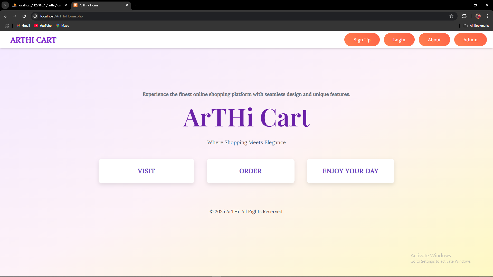
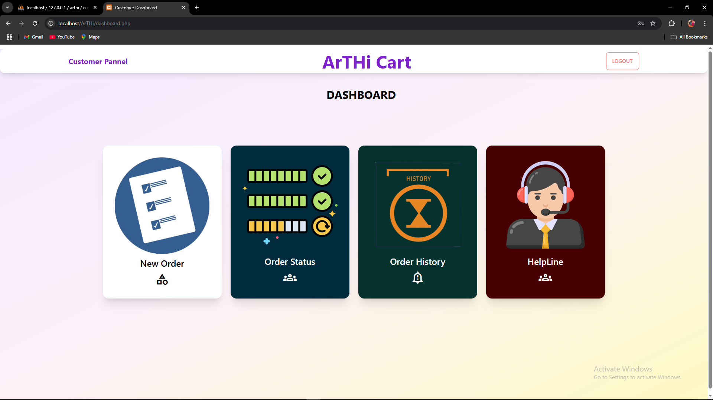
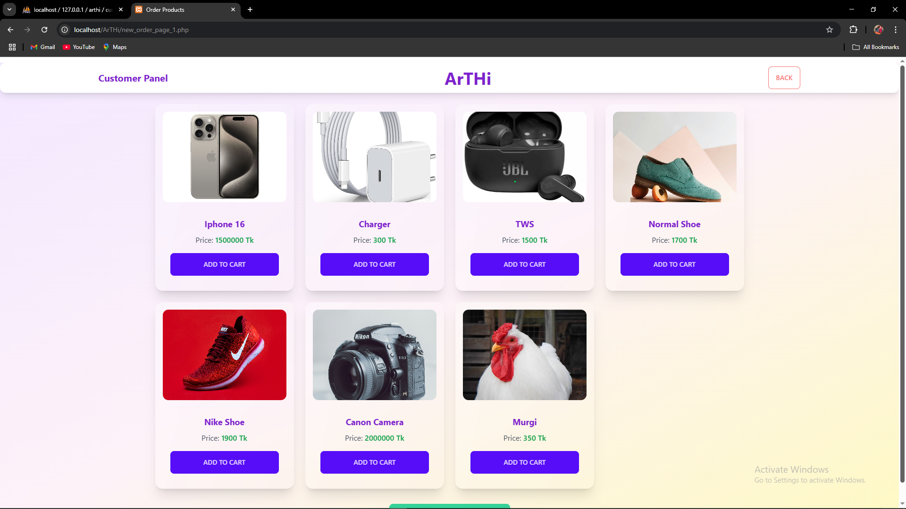
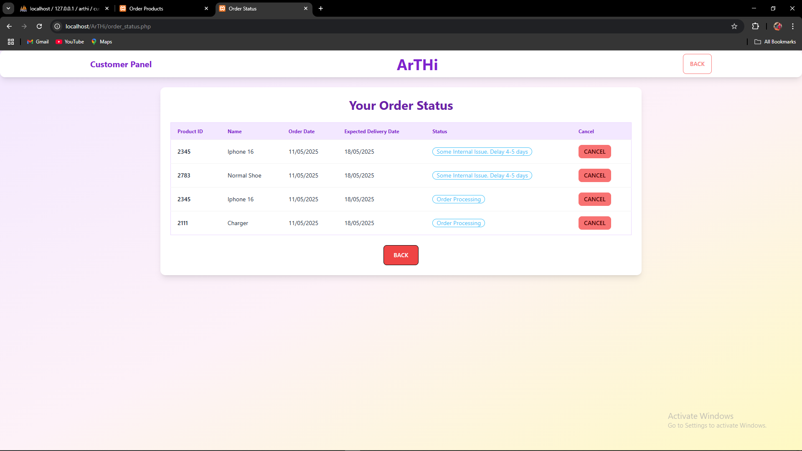
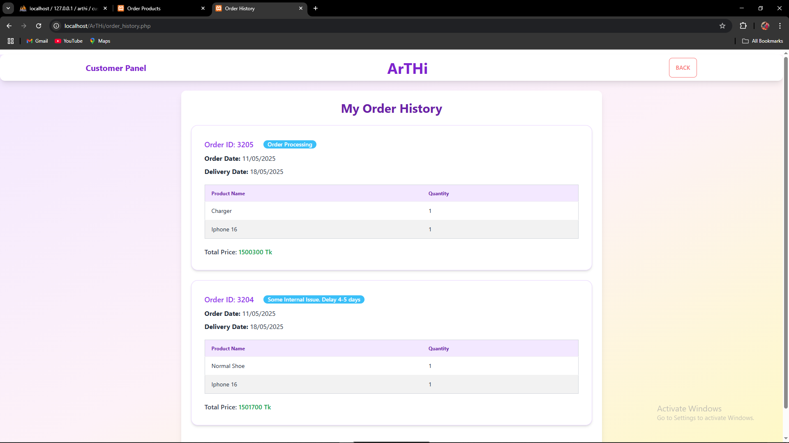
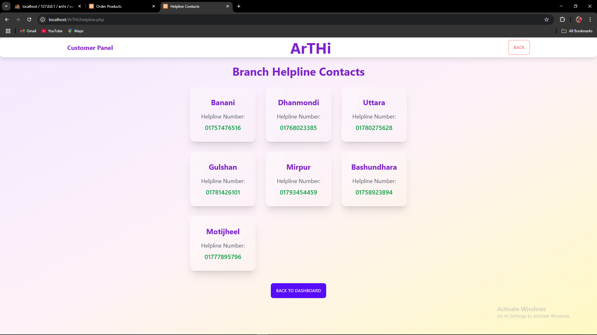
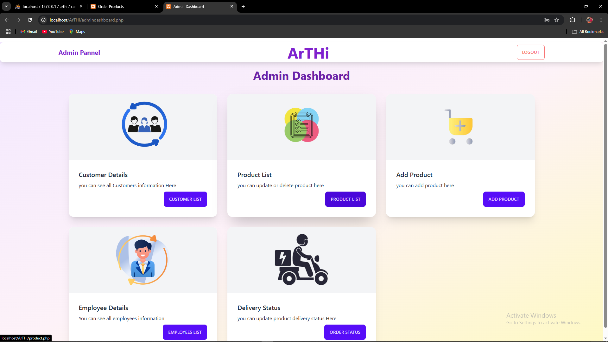
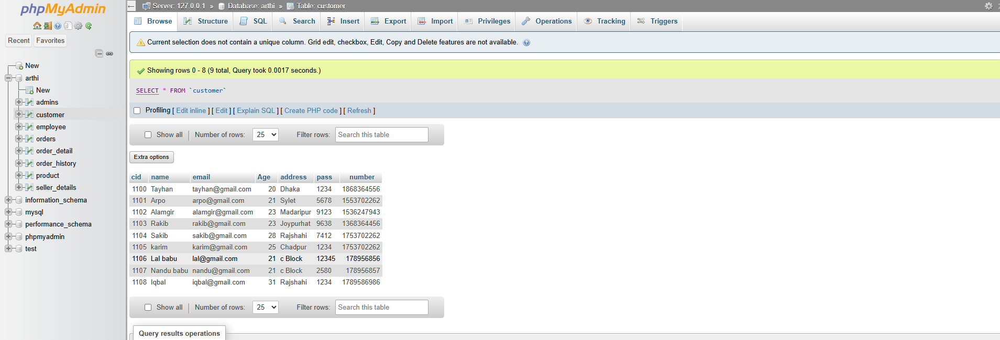

# 🛒 Arthi Cart Online

**Arthi Cart Online** is a simple and user-friendly e-commerce web application developed in PHP and MySQL, designed to handle both customer and admin functionalities efficiently. The platform enables customers to browse, purchase, and track products, while the admin can manage orders, products, and users from a centralized dashboard.

---

## 🔥 Features

### 👤 Customer Panel

- **Signup/Login**: Customers can register and log into their accounts securely.
- **Product Purchase**: Customers can browse and purchase products.
- **Order Status**: Real-time tracking of current orders (e.g., Ongoing, Shipped, Delivered).
- **Delete Order**: Customers can cancel/delete orders before shipping.
- **Order History**: Displays a complete purchase history specific to the logged-in user.
- **Helpline**: View detailed contact information of all branch offices including names and addresses.

### 🛠️ Admin Panel

- **Admin Login**: Secure login for admin access.
- **Dashboard Access**: Admin dashboard with a summary of platform activities.
- **Customer Management**: View all registered customer details.
- **Employee Management**: View employee information.
- **Product Management**: Add, update, or delete product listings.
- **Order Management**: Update order statuses (Ongoing → Shipped → Delivered).

---

## 📷 Project Screenshots

Below are some screenshots showcasing various parts of the project:

### Customer Side:
- 
- 
- 
- 
- 
- 

### Admin Side:
- 
- 

> 📁 **Full visual preview** available inside the `project_view` folder after cloning the repository.

---

## ⚙️ Installation & Setup

1. **Install [XAMPP](https://www.apachefriends.org/index.html)** if not already installed.
2. Move the entire project folder to:
3. **Import the database:**
- Open `phpMyAdmin`.
- Create a new database (e.g., `arthi`).
- Import the provided SQL file.

4. **Run the server:**
- Open XAMPP and start **Apache** and **MySQL**.
- Go to your browser and visit:
  ```
  http://localhost/Arthi/Home.php
  ```

---

## 📝 Notes

- Make sure the project folder is correctly placed under `htdocs`.
- Double-check the database configuration (`db connection`) in your PHP files.
- This project is ideal for educational purposes and small-scale e-commerce implementations.

---

## 🙌 Credits

Developed by **Arpo Roy**  
North South University | CSE Department

---

## 📬 Contact

For any queries or support:
- Email: [arporoy008@gmail.com]
- GitHub: [https://github.com/arpo008]

---

## ⭐ Show Your Support

If you found this project helpful, consider giving it a ⭐ on GitHub!

